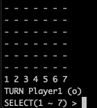

# 4目並べ

## Requirement

- gcc or Clang
- GNU Make

## Usage

```
git clone https://github.com/ryo-manba/dena-review
cd dena-review && make
./connect4
```

## How to play?
1．モード選択をします。<br>


2.行番号を選択しコマを配置していきます。<br>



3.縦横斜めのどれかに、先に４つコマを並べた方の優勝です。

## Features
CPUのアルゴリズムでは[モンテカルロ法](https://ja.wikipedia.org/wiki/%E3%83%A2%E3%83%B3%E3%83%86%E3%82%AB%E3%83%AB%E3%83%AD%E6%B3%95)を利用しています。

各行ごとのシミュレーション回数は、

- EASY   : 25
- NORMAL : 100
- HARD   : 500

となっています。


もっとも勝利数が多いものを選択します。

<br>

`includes/Const.hpp`の
```
#define COL_LEN 6
#define ROW_LEN 7
```
を変更することで盤面のサイズを変更することも可能です。


## Author

[twitter](https://twitter.com/ryo_manba)

## Licence

All code is released under the [MIT](https://github.com/ryo-manba/dena-review/blob/main/LICENSE) license
